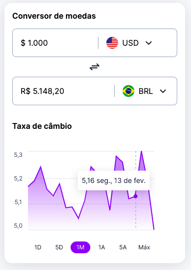
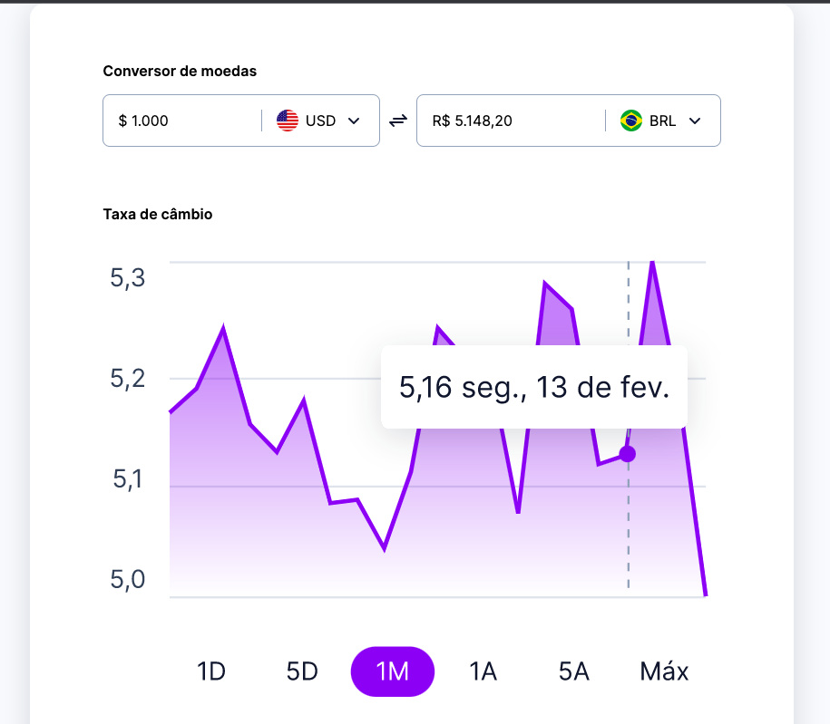

<h1 align="center"> RocketSeat - Bora Codar - Desafio 09</h1>

<h2 align="center"> #boraCodar um conversor de moedas</h2>

  <a href="#-tecnologias">Tecnologias</a>&nbsp;&nbsp;&nbsp;|&nbsp;&nbsp;&nbsp;
  <a href="#-projeto">Projeto</a>&nbsp;&nbsp;&nbsp;|&nbsp;&nbsp;&nbsp;
  <a href="#deploy">Deploy</a>&nbsp;&nbsp;&nbsp;|&nbsp;&nbsp;&nbsp;

 Mobile

 Desktop

 

## 🚀 Tecnologias

Esse projeto foi desenvolvido com as seguintes tecnologias:

- HTML e CSS
- Git e Github
- Figma

## 💻 Projeto

Conversor de moedas

## Deploy

✅ [Github](https://github.com/amesq01/boracodar---desafio09)

✅ [Vercel](https://boracodar-desafio09.vercel.app/)

✅ [RocketSeat - Bora Codar](https://www.rocketseat.com.br/boracodar#)

Adailton Mesquita
